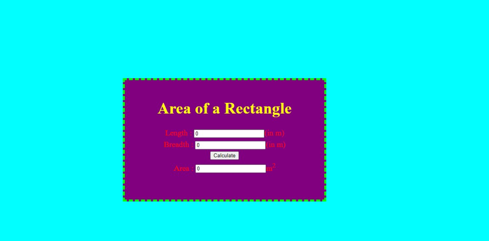
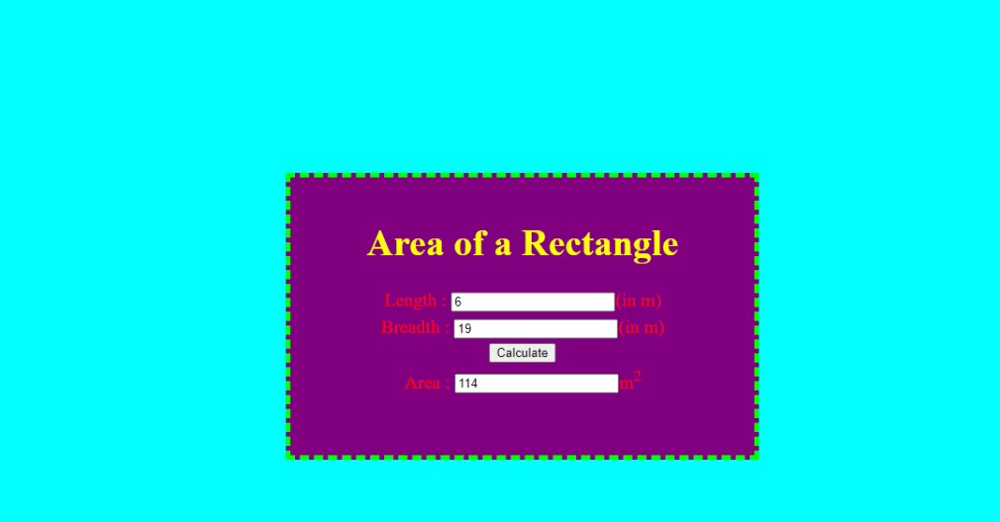

# Design a Website for Server Side Processing

## AIM:
To design a website to perform mathematical calculations in server side.

## DESIGN STEPS:

### Step 1:
Desing your website for calculation using wireframe work


### Step 2:

Then to execute the wireframe work desing use html,css

### Step 3:
Use views.py to execute the coding in serverside


### Step 4:

Mention the path of the website in urls.py

### Step 5:
Publish the website in the given URL

## PROGRAM :
math.html
```html
<html>
<head>
<meta charset='utf-8'>
<meta http-equiv='X-UA-Compatible' content='IE=edge'>
<title>Area of Rectangle</title>
<meta name='viewport' content='width=device-width, initial-scale=1'>
<style type="text/css">
body 
{
background-color:cyan;
}
.edge {
width: 1080px;
margin-left: auto;
margin-right: auto;
padding-top: 200px;
padding-left: 300px;
}
.box {
display:block;
border: Thick dashed lime;
width: 500px;
min-height: 300px;
font-size: 20px;
background-color: purple;
}
.formelt{
color: Red;
text-align: center;
margin-top: 5px;
margin-bottom: 5px;
}
h1
{
color: yellow;
text-align: center;
padding-top: 20px;
}
</style>
</head>
<body>
<div class="edge">
<div class="box">
<h1>Area of a Rectangle</h1>
<form method="POST">

<div class="formelt">
Length : <input type="text" name="length" value="{{l}}"></input>(in m)<br/>
</div>
<div class="formelt">
Breadth : <input type="text" name="breadth" value="{{b}}"></input>(in m)<br/>
</div>
<div class="formelt">
<input type="submit" value="Calculate"></input><br/>
</div>
<div class="formelt">
Area : <input type="text" name="area" value="{{area}}"></input>m<sup>2</sup><br/>
</div>
</form>
</div>
</div>
</body>
</html>

```

urls.py
```py
from django.contrib import admin
from django.urls import path
from myapp import views


urlpatterns = [
    path('admin/', admin.site.urls),
    path('areaofrectangle/',views.rectarea,name="areaofrectangle"),
]


```
views.py


```py

from django.shortcuts import render
from django.template  import loader
from django.shortcuts import render
# Create your views here.


def rectarea(request):
    context={}
    context['area'] = "0"
    context['l'] = "0"
    context['b'] = "0"
    if request.method == 'POST':
        print("POST method is used")
        l = request.POST.get('length','0')
        b = request.POST.get('breadth','0')
        print('request=',request)
        print('Length=',l)
        print('Breadth=',b)
        area = int(l) * int(b)
        context['area'] = area
        context['l'] = l
        context['b'] = b
        print('Area=',area)
    return render(request,'myapp/math.html',context)
```

## OUTPUT:




## Result:
this program is executed successfully

